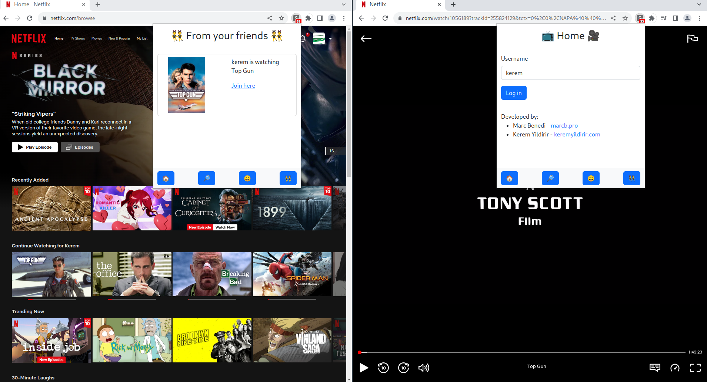

# Social Stream

## Inspiration
Our motivation for this project stems from a common problem many people encounter in today's world. Before the streaming services, everything was shown in the TV and  people had to keep track of many different channels to watch their favorite shows and movies. The emerge of streaming services turned the tides quite fast, and streaming services quickly became the preferred media consumption method due to their convenience. However, with more and more streaming services coming to life rapidly, it seems like the world is going back to how it was before, in order to enjoy all of their media, people have to subscribe and use many different services which essentially does the same thing. Most of the time, different parts of the world have different licensing issues, so the content of different services also show local differences. Even though subscription is inevitable for legal media consumption, we have decided to utilize the data given to us to process the available content of different services and build a browser extension to quickly utilize and enjoy their favorite shows on multiple platforms with the comfort of the simplicity of browser extensions. 

## What it does
 * Opportunity to the people to  seamlessly switch to the service of their choice, removing the need to search for available platforms even while searching for a movie. You are searching for a movie in Netflix, but it is only available in Disney+? We find the link for you and provide it to you, so you do not have to look for the available platforms your show, just enjoy.

* A machine learning based cross-platform content recommendation system which helps you get additional content recommendations from other platforms you are using, complementing the service being currently used. Netflix provides great recommendations for watching what to watch next, but maybe you will find some stuff from Amazon Prime or Apple iTunes more exciting? All available inside the extension for people to discover :)

 * A convenient social dashboard which enables people to see what their friends' are watching and easily joining them, just like in Spotify.

## How we built it
We used AngularJS for the front end and Python for the backend and Machine Learning parts.

## Challenges we ran into
* Browser extensions limit the flexibility of the developer, making it hard to use existing frameworks
* Without actual user data, it is harder to see the patterns and recommend content to users
* Different platforms have different notations for the same annotations, requiring more data preprocessing than expected

## Accomplishments that we're proud of
* We managed to make a compact feature rich product without prior development experience 

## What we learned
* How to work with textual data
* How do recommendation systems work
* How to build a browser extension with zero to none prior experience

## What's next for Social Stream
 * Adding more streaming services to expand the existing database
 * WebRTC support for synchronized streaming, enabling  enjoying your favorite movies/series together with friends
 * More powerful recommendation system by utilizing user history and reviews
